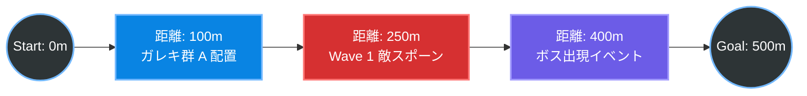

# レールシューティングのマップ構造アーキテクチャ

レールシューティングにおける「レベルデザイン（マップデータ）」は、3D空間上の絶対座標（X,Y,Z）だけで管理するのではなく、**「レール（スプライン）のスタート地点からの距離（あるいは進行度 `t`）」を基準としたタイムライン**で管理するのが鉄則です。

## 1. 概念図（距離ベースのイベントトリガー）

プレイヤーがレール上を進んだ「距離（Distance）」を監視し、特定の距離に到達した瞬間にイベント（敵の出現、ガレキの配置、カメラワークの変更）を発火させます。



## 2. マップデータ（JSON/CSV）のイメージ

Alpha版で実装する外部ファイル（マップデータ）は、以下のような構造になります。
「どこ（絶対座標）に置くか」ではなく、**「レール上のどこ（進行度）で発生し、レールから見て相対的にどの位置にいるか」**を定義します。

```json
{
  "Stage1_LevelData": {
    "SplinePoints": [
      {"x": 0, "y": 0, "z": 0},
      {"x": 0, "y": 10, "z": 100},
      {"x": 50, "y": 20, "z": 200}
    ],
    "Events": [
      {
        "TriggerDistance": 50.0,
        "Type": "SpawnDebris",
        "Count": 100,
        "OffsetFromRail": {"x": 10, "y": -5, "z": 20}
      },
      {
        "TriggerDistance": 120.0,
        "Type": "SpawnEnemyWave",
        "WaveID": "Wave_01",
        "Formation": "V_Shape"
      },
      {
        "TriggerDistance": 300.0,
        "Type": "SpawnBoss",
        "BossID": "Boss_Core"
      }
    ]
  }
}
```

## 3. なぜ「絶対座標」ではなく「距離ベース」なのか？

もし敵やイベントを「ワールド座標（X,Y,Z）」で配置してしまうと、後からプランナーが**「レールのカーブの曲がり具合をちょっと変えたい」**と言った瞬間に、すべての敵やガレキの座標を手作業でズラして修正しなければならず、地獄を見ます。

「レールからの距離（進行度）」と「レールからの相対座標（オフセット）」でデータを保持しておけば、レール自体の形を後からぐにゃぐにゃ変えても、**敵やイベントは自動的にレールに追従してくれます。**

## 4. WaveManager（進行管理者）の役割

Alpha版で実装すべき `WaveManager` クラスの役割は非常にシンプルになります。

1. 毎フレーム、プレイヤーの `現在の進行距離 (CurrentDistance)` を取得する。
2. 読み込んだJSONの `Events` 配列の先頭を見て、`TriggerDistance <= CurrentDistance` になっていたら、そのイベントを実行（敵をSpawn）する。
3. 実行したイベントをキューから破棄し、次のイベントの到達を待つ。

この仕組みさえできれば、レールシューティングのマップ進行は完全に制御可能になります。
